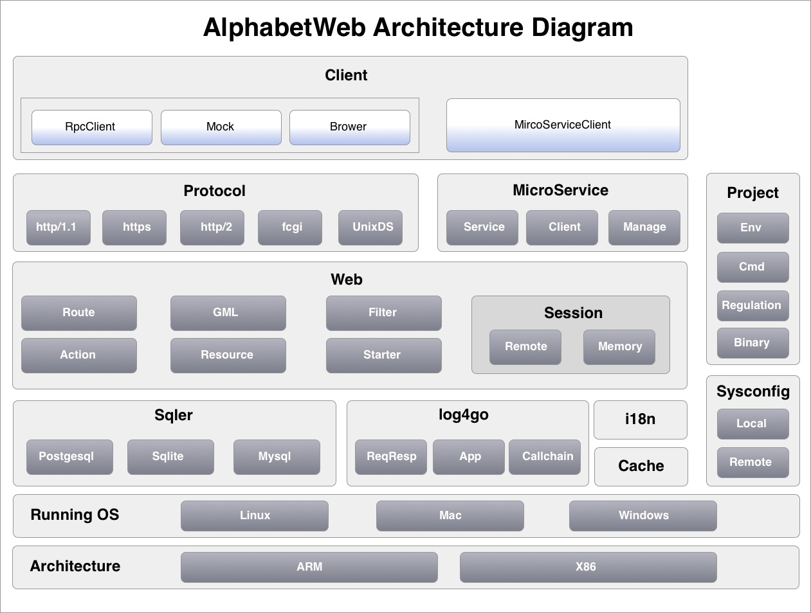
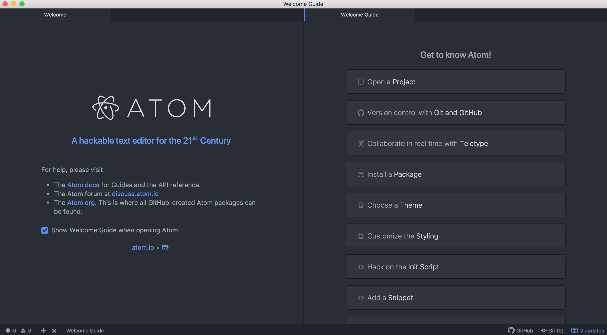
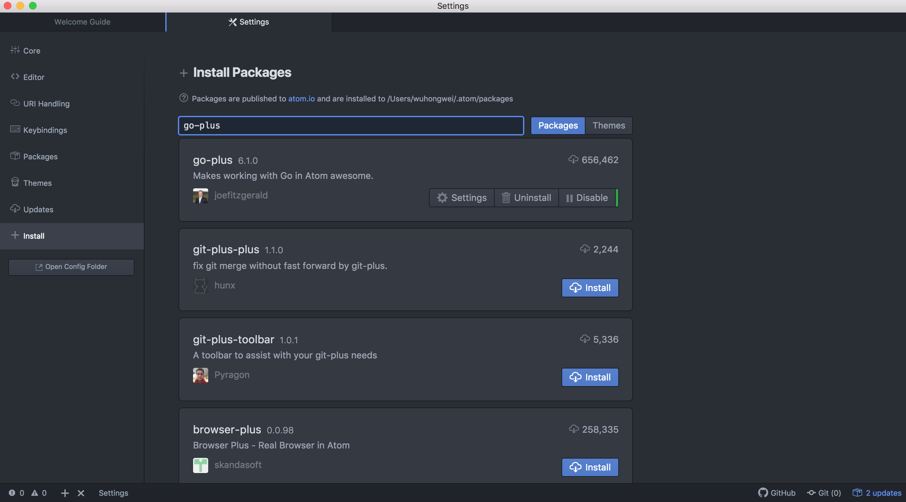

# Vikingbays • AlphabetWeb

更多资料，请访问 : [https://www.vikingbays.com](https://www.vikingbays.com) 。

AlphabetWeb希望提供更加专业的，更加高效的，更加方便的开发架构，

AlphabetWeb是一个服务端开发框架，可用于搭建一个web网站，也可以构建复杂的微服务场景，也可用于中后台服务定制。AlphabetWeb采用Golang语言实现，具有一次开发多平台部署，运行效率更优。AlphabetWeb架构设计之初，不仅提供丰富的组件包，而且从开发者角度，注重开发过程的便捷性。

AlphabetWeb提供的架构图如下：


AlphabetWeb 采用MVC的web架构，提供分布式session管理（AlphabetWeb.Web）。提供多种组件：包括：数据库访问（AlphabetWeb.Sqler）、日志管理（AlphabetWeb.log4go）、国际化支持（AlphabetWeb.i18n）、缓存管理（AlphabetWeb.Cache）。服务访问支持标准的应用协议，包括：http/1.1，https，http/2，fcgi，unixDS等协议（AlphabetWeb.Protocol），同时也可以采用微服务方式访问（AlphabetWeb.MicroService），同时提供对应的客户端包访问（AlphabetWeb.Client）。AlphabetWeb 项目管理提供一套命令工具集、构建约定等（AlphabetWeb.Project），同时提供项目配置项管理（AlphabetWeb.Sysconfig）。AlphabetWeb 可以在Linux、Mac、Windows等平台上开发（AlphabetWeb.RunningOS），可运行在ARM、X86等架构上（AlphabetWeb.Architecture）。


## 一、特性/价值介绍

### 1. AlphabetWeb 提供丰富的套餐组合。
AlphabetWeb提供常用的服务端开发解决方案 ，包含了：1）、MVC 的web架构，2）、ORM数据访问、3）、统一日志管理、4）、集成第三方中间件框架，适配mysql、Postgresql、redis 等。

### 2. AlphabetWeb 支持友好的微服务场景。
AlphabetWeb提供微服务架构支持，微服务的开发和web应用开发无差异化，降低开发门槛。能够更好/更快的支持 web应用功能 向 微服务功能转移。

### 3. AlphabetWeb 采用Golang语言开发，很好支持server端开发。
golang语言先天性优势，更易于server端应用开发。与java相比，提供更好的性能保障，节约资源损耗。

### 4. http/2支持，实现多路复用。
AlphabetWeb提供基于http/2的协议模型，实现多路复用。有效的减少了TCP/IP连接数开销，提升并发访问性能。在Web场景、微服务场景都可适用。

### 5. 统一配置中心，使代码和环境配置分离。
AlphabetWeb提供统一配置中心，为应用系统提供多套配置项适配于不同的场景。例如：开发环境配置文件、测试环境配置文件、线上环境配置文件。使应用配置与代码工程解藕。

### 6. 支持访问调用链，跟踪服务的请求轨迹。
AlphabetWeb提供访问调用链管理，跟踪服务调用轨迹，有效支持多级微服务场景下的请求跟踪。

### 7. 跨平台支持，兼容性较好。
AlphabetWeb提供跨平台支持，支持windows、mac、linux、arm-linux 环境下运行。实现 一处开发，多平台部署。针对源码支持二进制打包，减少部署依赖（不需要运行环境），提升代码安全性保护。

### 8. UnixDS协议，更好的模块化分层。
UnixDS协议（Unix Domain Socket），通过进程协议模拟tcp/ip通信，更好的把一个大服务拆分成多个小服务，实现物理模块化分层，多项目隔离。

### 9. 模块化代码管理，采用目录约定模式，两级模块化管理。
AlphabetWeb的目录约定，第一级：子系统级（ 例如：/src/simple001 ），第二级：功能级（ 例如：/src/simple001/func001 ）。子系统级具有完整性和隔离性，可以单独部署或重新组合。易于复杂项目支撑。通过一个项目挂载多个子系统，使开发者便于在一个IDE中开发，开发时，可以打包成一个服务运行调试，测试/发布时，可以自动拆分成微服务部署架构。帮助开发者在复杂环境下（例如：多层微服务），提升开发的便捷性。


## 二、如何安装

### 1.可运行环境
Alphabet可运行在 Microsoft Windows ，Apple macOS ，Linux 等平台上。

### 2.安装golang
在 https://golang.google.cn 中下载golang安装包。根据不同的平台，选择不同的安装包。 下载完成后，解压到制定目录，例如：
```
/Users/vikingbays/golang/go
```

设置golang环境变量配置。

编辑系统环境变量文件：

```
vi ~/.bash_profile
```

在 .bash_profile文件中添加如下信息：

```
export GOROOT = "/Users/vikingbays/golang/go"
export PATH   = "$PATH:$GOROOT/bin"
export GOPATH = "/Users/vikingbays/golang/mygopath"
```

激活配置文件中环境变量：
```
. ~/.bash_profile
```
测试是否配置成功：
```
$ go version
返回：
  go version go1.xx.x darwin/amd64
```
说明：

  GOROOT 用于设置golang的安装路径。

  GOPATH 用于设置第三方应用路径，可以设置多个。

    通过go install/go get等工具获取的第三方包都放入到GOPATH设置的第一个路径中。

    GOPATH设置的路径是一个工程项目，里面主要包含三个目录: bin、pkg、src 。

### 3.安装AlphabetWeb
在github上下载AlphabetWeb安装包，下载后完成后，解压到指定目录，例如：

```
/Users/vikingbays/golang/AlphabetwebProject/alphabetweb
```
编辑系统环境变量文件：
```
vi ~/.bash_profile
```
添加环境变量：
```
export GOPATH = "$GOPATH:/Users/vikingbays/golang/mygopath"
```
激活配置文件中环境变量：
```
. ~/.bash_profile
```

### 4.安装IDE：Atom
在https://atom.io下载Atom安装包。根据不同的平台，选择不同的安装包。

下载并安装完成后启动Atom，打开Atom界面如下：



选择Atom->Preferences->Install , 安装插件：go-plus ， file-icons ， atom-beautify 。界面如下：


### 5.创建一个AlphabetWeb项目
一个AlphabetWeb项目的构成需要满足如下原则：

按照golang项目目录结构创建一级目录： bin、logs、pkg、upload、src 。

一个AlphabetWeb 可以包含多个应用包集合，他在src的下一级目录。

应用包集合：可以理解为URL地址的一级目录。他的结构是：

```
src
  glass     # 访问地址：  http://ip:port/glass/...
  stone     # 访问地址：  http://ip:port/stone/...
  books     # 访问地址：  http://ip:port/books/...
创建一个项目（glassProject），他的目录结构如下：

  glassProject                        # 项目名称
     bin                                
     logs                             # 日志存储路径
     pkg
     upload
     src                              # 源码存放路径
        glass                         # 应用包集合，包含了 app1,app2,... 等应用。
                                      # 可支持一个src下定义多个应用包集合。
           app1                       # 一个应用，可包含多个功能，具有独立体系的代码。
                                      # 包括：视图、控制器、查询sql、服务等。
           app2
           ...
           dbsconfig.toml             # (可选)数据库配置文件，包括可注册的数据库，例如：app1中注册的pg_test1 。
           logconfig.toml             # (必选)日志配置文件。
           logconfig_http.toml        # (必选)http日志配置文件。记录请求响应时长
           webconfig.toml             # (必选)web配置文件。
           cachesconfig.toml          # (可选)cache配置文件。
           ms_server_config.toml      # (可选)微服务的服务端配置文件 。
           ms_client_config_01.toml   # (可选)微服务的服务端配置文件，可以是多个 _02 _03 _04 ....
```


## 三、Helloworld : 第一个web应用

通过一个Helloworld的例子，学习基于alphabetWeb搭建web应用。

### 1. 项目路径和目录
项目路径：/Users/vikingbays/golang/AlphabetwebProject/sample_helloworld

创建项目目录：
```
sample_helloworld
   bin
   logs
   pkg
   upload
   src
      helloworldsimple
```

### 2. 创建Sysconfig配置项

#### 2.1. 创建webconfig.toml
所在路径：/Users/vikingbays/golang/AlphabetwebProject/sample_helloworld/src/helloworldsimple/webconfig.toml

配置内容如下：
```toml
[[servers]]
protocol="http"              # 定义协议，采用http方式， 支持协议有：http，https, fcgi_unix ,rpc_unix ,rpc_tcp ,rpc_tcp_ssl
                             # 其中fcgi_unix是指：fcgi UnixDomainSocket ,rpc_unix是指：rpc方式的 UnixDomainSocket
addr=""                      # 定义地址, 如果protocol="unix"，那么addr就需要设置为xxxx.sock的文件地址，例如： "/tmp/alphabetsample.sock"
                             # 支持 ${project} 变量，表示项目根目录
                             #   addr="${project}/alphabetsample.sock"
port=9009                    # 定义端口
timeout=100                  # 超时时长，单位秒
maxconn=100                  # 最大连接数，暂时不支持

[[web]]
context="web1"                       # 定义web访问根路径
apps="*"                             # 是否过滤应用包
mode="develop"                       # develop 是开发者模式， product 是生产模式，
i18n="en"                            # 设置缺省的国际化信息，如果定义 i18n="en" ，那么就会查找 /apps/app**/i18n/en.toml内容
sessionid="alphabet09-session-id"    # 设置sessionid 信息
sessionmaxage=600                    # 设置session失效日期，单位是秒
sessionobjectcount=10000             # 设置session可以存储的对象数，超过该对象，就会启动清理 ，一个对象就是一个session会话
sessiongenkey="dA~$%3@2*sAw  (:sQQ"  # 设置session产生key，用于加密
sessionstore="memory"                # session存储方式，支持 memory 和 redis 两种
sessionstorename="cache2"            # 设置session存储库的名称，
                                     # 如果是redis方式，那么就是设置cachesconfig.toml的某个库；
                                     # 如果是memory方式，那么就设置""。
                                     # 如果没有设置，那么默认是memory方式。

[[uploadfile]]
memcachesize=8388608                 # 文件在读取过程中的缓存大小,单位字节，在一定范围内越大，读写速度越快
maxsize=33554432                     # 文件大小,单位字节
storepath="${project}/upload"        # 文件上传的存储地址,其中 ${project} 表示项目根目录，例如：${project}/upload
splitonapps=true                     # 是否按照应用（apps）分目录

[[project]]
cpunum=3                             # 设置CPU使用个数

```

#### 2.2. 创建logconfig.toml

所在路径：/Users/vikingbays/golang/AlphabetwebProject/sample_helloworld/src/helloworldsimple/logconfig.toml

配置内容如下：
```TOML
[[filters]]
enabled="true"
tag="file"
type="file"
level="INFO"   # �������� (:?FINEST|FINE|DEBUG|TRACE|INFO|WARNING|ERROR)
format="[%D %T] [%L] (%S) %M "   

filename="${project}/logs/apps.log"  # ���Դ����� ${project}/logs/test.log
rotate="false"
rotateMaxSize="0"    #\d+[KMG]? Suffixes are in terms of 2**10
rotateMaxLines="0"   #\d+[KMG]? Suffixes are in terms of thousands
rotateDaily="false"
```

#### 2.3. 创建logconfig_http.toml

所在路径：/Users/vikingbays/golang/AlphabetwebProject/sample_helloworld/src/helloworldsimple/logconfig_http.toml

配置内容如下：

```toml
[[filters]]
enabled="true"
tag="file"
type="file"
level="INFO"   # �������� (:?FINEST|FINE|DEBUG|TRACE|INFO|WARNING|ERROR)
format="[%D %T] [%L] %M "   

filename="${project}/logs/http.log"  # ���Դ����� ${project}/logs/test.log
rotate="false"
rotateMaxSize="0"    #\d+[KMG]? Suffixes are in terms of 2**10
rotateMaxLines="0"   #\d+[KMG]? Suffixes are in terms of thousands
rotateDaily="false"
```

### 3. 创建应用功能

#### 3.1. 搭建应用目录
一个常规的应用目录结构如下：

```
sample_helloworld
   ...
   src
      helloworldsimple
         hello
            config        #(可选)
               db         #(可选) sql配置文件存储
            i18n          #(可选) 国际化
            resource      # 静态资源
            view          # 视图
```

#### 3.2. 创建控制器代码

创建一个helloworld.go文件。

所在路径： /src/helloworldsimple/hello/helloworld.go

编写控制器代码：

```go
package hello

import (
	"alphabet/web"
)

/**
 * 访问方式：  http://[ip]:[port]/[webcontext]/hello/helloworld
 */

type GiftInfo struct {
	GName   string
	GNumber int
	GFriend []string
}

type ParamHelloWorld struct {
	GiftName   string
	GiftNumber int
	Friends    []string
}

func HelloWorld(paramHelloWorld *ParamHelloWorld, context *web.Context) {

	if paramHelloWorld == nil {
		context.Return.Forward("helloworld_index", nil)
	} else {
		if paramHelloWorld.GiftName != "" {
			giftInfo := new(GiftInfo)
			giftInfo.GName = paramHelloWorld.GiftName
			giftInfo.GNumber = paramHelloWorld.GiftNumber
			giftInfo.GFriend = paramHelloWorld.Friends
			context.Return.Forward("helloworld_gift", giftInfo)
		} else {
			context.Return.Forward("helloworld_index", nil)
		}
	}

}
```

#### 3.3. 创建视图代码
添加 helloworld_index.gml 和 helloworld_gift.gml

所在路径：/src/helloworldsimple/hello/view/helloworld_index.gml

所在路径：/src/helloworldsimple/hello/view/helloworld_gift.gml

helloworld_index.gml是默认初始化页面，具体代码如下：
```html
<html>

<script src="resource/jquery/jquery-1.12.1.js"></script>
<script src="resource/bootstrap3.3.6/js/bootstrap.min.js"></script>

<link rel="stylesheet" type="text/css" href="resource/bootstrap3.3.6/css/bootstrap.min.css">
<link rel="stylesheet" type="text/css" href="resource/bootstrap3.3.6/css/bootstrap-theme.min.css">
<link rel="stylesheet" type="text/css" href="resource/bootstrap3.3.6/css/docs.min.css">

<body>

  <div style='height:60px'></div>

  <div class="container">

  <div>
    <form class="form-inline"  action="">
      <br>
      <div class="form-group" style='padding-top:15px'>
      <label for="giftNameId">礼物 :</label>
      <input type="text" style="width:200px" class="form-control" name='giftName' id='giftNameId' placeholder="请输入礼物">
      </div>
      <br>
      <div class="form-group" style='padding-top:15px'>
      <label for="giftNumberId">数量 :</label>
      <input type="text" style="width:200px" class="form-control" name='giftNumber' id='giftNumberId' placeholder="请输入数量">
      </div>
      <br>
      <div class="form-group" style='padding-top:15px'>
      <label for="giveId">"送给 :</label>
      <input type="text" style="width:80px" class="form-control" name='friends' id='giveId' >，
      <input type="text" style="width:80px" class="form-control" name='friends' id='giveId' >，
      <input type="text" style="width:80px" class="form-control" name='friends' id='giveId' >，
      <input type="text" style="width:80px" class="form-control" name='friends' id='giveId' >
      </div>
      <br>
       <div class="form-group" style='padding-top:15px'>
      <button type="submit" class="btn btn-primary">提交</button>
      </div>
    </form>
  </div>
  </div>
</body>
</html>
```

helloworld_gift.gml是获取数据页面，具体代码如下：

```html
<html>

<script src="resource/jquery/jquery-1.12.1.js"></script>
<script src="resource/bootstrap3.3.6/js/bootstrap.min.js"></script>

<link rel="stylesheet" type="text/css" href="resource/bootstrap3.3.6/css/bootstrap.min.css">
<link rel="stylesheet" type="text/css" href="resource/bootstrap3.3.6/css/bootstrap-theme.min.css">
<link rel="stylesheet" type="text/css" href="resource/bootstrap3.3.6/css/docs.min.css">

<body>

  <div style='height:60px'></div>

  <div class="container">

  <div class="bs-callout bs-callout-danger" id="callout-glyphicons-dont-mix">
    <h4>从Form表单中直接收到 : </h4>
    <p>
      <div>
       礼物 : {{index .Params.giftName 0}}
       </div>
       <div>
       数量: {{index .Params.giftNumber 0}}
       </div>
       <div>
       送给 : {{index .Params.friends 0}} ，
             {{index .Params.friends 1}} ，
             {{index .Params.friends 2}} ，
             {{index .Params.friends 3}}
       </div>
    </p>
  </div>

  <div class="bs-callout bs-callout-info" id="callout-glyphicons-dont-mix">
    <h4>从加工的数据中收到 :  </h4>
    <p>
      <div class="respDataForGiftName">
       礼物 : <span>{{.Datas.GName}}</span>
       </div>
       <div class="respDataForGiftNumber">
       数量 : <span>{{.Datas.GNumber}}</span>
       </div>
       <div class="respDataForFriends">
       送给 : {{range $n,$v := .Datas.GFriend}}
                {{if ne $v ""}}
                   <span>{{$v}}</span>,
                {{end}}
             {{end}}
       </div>
    </p>
  </div>

  </div>

</body>
</html>
```

#### 3.4. 配置路由规则
配置路由规则route.toml。 所在路径：/src/helloworldsimple/hello/route.toml

```toml
[[action]]
HelloWorld="helloworld"

[[gml]]
helloworld_index="view/helloworld_index.gml"
helloworld_gift="view/helloworld_gift.gml"
```

#### 3.5. 预计访问路径
```
http://localhost:9009/web1/hello/helloworld
```

### 4. 启动项目并验证
#### 4.1. 启动项目
启动命令：
```
AlphabetwebProject="/Users/vikingbays/golang/AlphabetwebProject/alphabetweb"

sample_helloworld="/Users/vikingbays/golang/AlphabetwebProject/sample_helloworld"

go run $AlphabetwebProject/src/alphabet/cmd/abserver.go -start "$sample_helloworld"
```

#### 4.2. 验证
访问：
```
http://localhost:9009/web1/hello/helloworld
```
